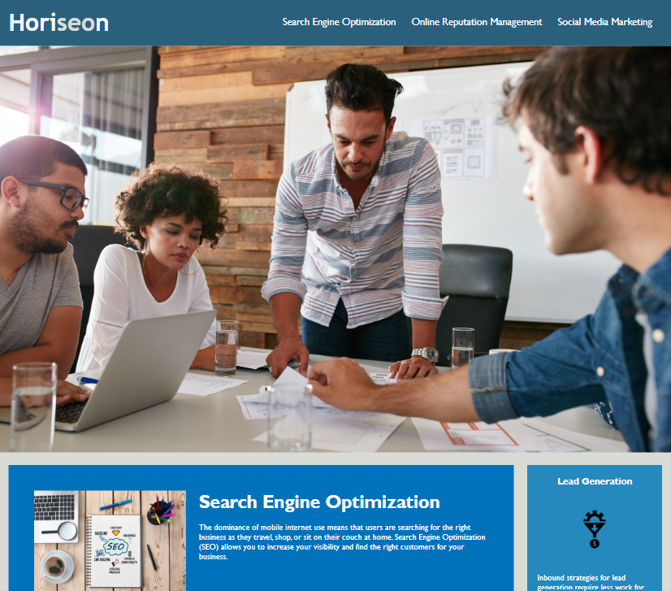
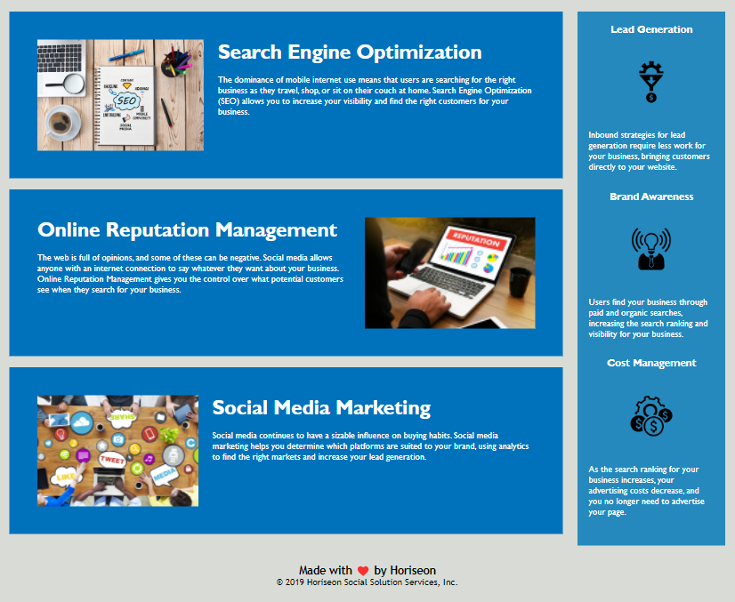

# README file

## Description

This is the home page of a website for a company called Horiseon. There is a navigation at the top of the page which includes the name of the company as the title on the left and three navigation links on the right. When a user clicks one of these three links, the page automatically scrolls down to the relevant section of the page.

This navigation element is followed by a large image.

The homepage then features three HTML elements right after eachother, each has an image, a title and a description.

On the right hand side of these three elements, there is another HTML element that runs vertically down rather than horizontally across the page.

The page ends with a footer with text that is horizontally centered on the page.

## URL link to application

https://ishan-wijesingha99.github.io/Module-1-Challenge-My-Repo/

## Screenshot of application

